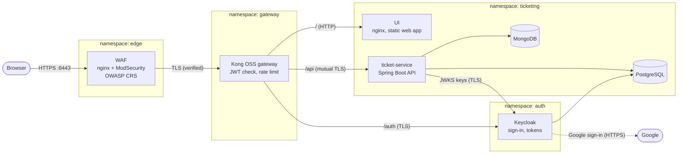
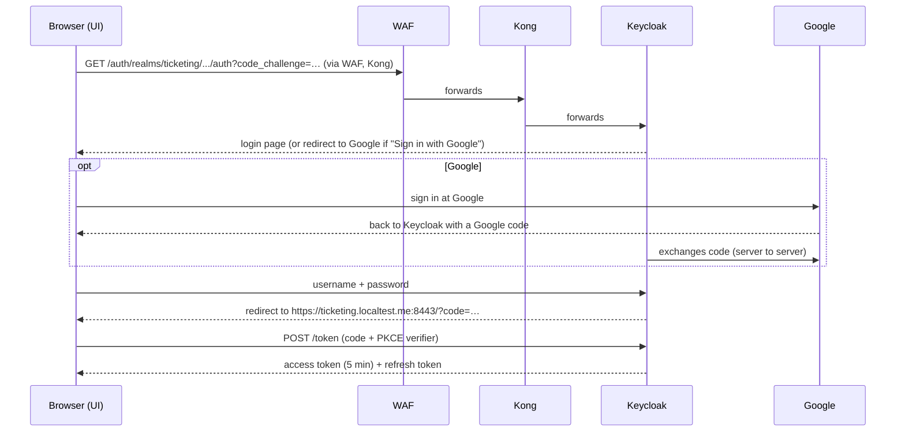

# 4. Architecture

## 4.1 What the application does

A **multi-tenant ticketing** system. Several customer organisations (*tenants*, e.g. `acme`, `globex`)
share one installation, but each sees only its own data.

* **Applicants** raise tickets (title, mobile number, description) and see only their own tickets.
* **Approvers** see all tickets of their tenant. They *pick up* a ticket (which **locks** it so no other
  approver can act on it), then **approve**, **reject** or **request more details**, always with a
  comment. Any approver of the tenant can **unlock** a ticket held by someone else. Approvers cannot act
  on tickets they raised themselves.
* One person can have different roles in different tenants.
* Users sign in with a username/password kept by Keycloak, or with their Google account.

## 4.2 The big picture



Plain-text version of the same picture:

```
Browser ──HTTPS──► WAF (edge) ──TLS──► Kong (gateway) ──┬── /      ──HTTP──► UI (nginx)
                   blocks attacks      checks JWT,      ├── /auth  ──TLS───► Keycloak ──► PostgreSQL (keycloak DB)
                                       rate limits      │                       └──► Google (optional sign-in)
                                                        └── /api   ──mTLS──► ticket-service ──► PostgreSQL (ticketing DB)
                                                                               └── re-checks JWT ──► MongoDB
```

## 4.3 Components

| Component | Namespace | What it is | Listens on | Data kept |
|---|---|---|---|---|
| **WAF** | `edge` | nginx with the ModSecurity engine and the OWASP Core Rule Set. The **only** component reachable from outside. Terminates the browser's TLS, inspects each request, forwards clean requests to Kong. | 8443 (exposed as 443, mapped to laptop port 8443) | none |
| **Kong** | `gateway` | API gateway (open-source edition, "DB-less": its configuration is one YAML file). Routes by path, verifies the login token on `/api`, rate-limits per user, adds a correlation ID. | 8443 (service port 443) | none |
| **Keycloak** | `auth` | Identity provider: login pages, users, groups, tokens (OpenID Connect / OAuth 2.0), Google sign-in. | 8443 (HTTPS); 8080 only for admin scripts inside the pod | in PostgreSQL (`keycloak` database) |
| **UI** | `ticketing` | The web application (plain HTML/JavaScript, no framework) served by nginx. | 8080 | none |
| **ticket-service** | `ticketing` | The REST API (Java 21, Spring Boot 3.5). All business rules. | 8443 (HTTPS, client certificate required) | none (stateless) |
| **PostgreSQL 16** | `ticketing` | Relational database: tenant registry, ticket workflow state; Keycloak's database. | 5432 | 1 GiB volume |
| **MongoDB 7** | `ticketing` | Document database: ticket content and history. | 27017 | 1 GiB volume |
| **cert-manager** | `cert-manager` | Issues and renews all internal TLS certificates from a private certificate authority. | – | certificates in Secrets |

All pods run a single copy (replica) in this laptop installation.

## 4.4 How a request flows

### Signing in (OpenID Connect, Authorization Code + PKCE)



* **PKCE** ("proof key for code exchange") means only the browser tab that started the login can
  exchange the code for a token, so an intercepted code is useless.
* The access token is a **JWT**: a signed JSON document containing the user's email and **groups**
  (`/acme/applicant` …). It is kept only in the page's memory (never in cookies or local storage).
* The UI renews the token in the background with the refresh token.

### Calling the API

```
1. Browser  → WAF     GET /api/tickets   Authorization: Bearer <JWT>   X-Tenant-ID: acme
2. WAF               TLS ends; ModSecurity inspects; unknown paths/attacks are refused here
3. WAF      → Kong    new TLS connection; WAF verifies Kong's certificate; adds X-Correlation-ID
4. Kong              jwt plugin: signature + expiry valid?  (no → 401)
                      rate limit: < 300 requests/minute for this user? (no → 429)
5. Kong     → API     mutual TLS: Kong presents its client certificate "kong-gateway"
6. API               checks caller certificate name = kong-gateway (else 403)
                      verifies the JWT again (signature, issuer, expiry, type, client)
                      works out tenant + roles from the groups claim and X-Tenant-ID
                      checks the role (applicant/approver) for this endpoint
7. API      → DBs     PostgreSQL (tenant bound to the DB session; Row-Level Security) + MongoDB (tenant filter)
8. Response flows back the same way; Kong returns X-Correlation-ID and rate-limit headers
```

## 4.5 Data model

```
PostgreSQL  database "ticketing"
  tenant            (id PK, name, active)
  ticket_workflow   (id PK uuid, tenant_id FK→tenant, owner_email, status, locked_by, locked_at,
                     created_at, updated_at, version)
                     + Row-Level Security policy: tenant_id = current tenant
                     + CHECK: status LOCKED ⇔ locked_by set;  owner never holds the lock
  flyway_schema_history  (which database migrations have run)

MongoDB  database "ticketing", collection "ticket_details"
  { _id: <same uuid>, tenantId, title, mobile, description, createdBy, createdAt,
    events: [ {type, actor, comment, at}, … ] }
```

**Why two databases?** The lock and approval rules need strict, atomic updates and database-enforced
rules: a relational database is the right tool, and PostgreSQL adds Row-Level Security for tenant
isolation. Ticket content and its growing history are flexible documents: a natural fit for MongoDB.
Because they are separate databases there is no single transaction across both: a new ticket is
written to MongoDB first and removed again if the PostgreSQL insert fails; later history entries are
appended after the PostgreSQL change succeeded (a failure is logged). See guide 3, section 3.4.

## 4.6 Inside the Java service

The service is split into three **Java modules** (`module-info.java`), and the module system is used
as a security boundary:

| Module | Contents | Exposes |
|---|---|---|
| `com.ticketing.security` (`ticket-security/`) | pure Java: reads tenant memberships from token groups, picks the active tenant, holds it for the current request | the tenant context API |
| `com.ticketing.core` (`ticket-core/`) | `TicketService` (all business rules) and its request/response types; **internally** the database entity, the PostgreSQL repository, the MongoDB store; database migrations | **only** `TicketService` and its DTOs |
| `com.ticketing.api` (`ticket-api/`) | REST controllers, Spring Security configuration, mTLS caller check, tenant filter, error handling; the runnable application | nothing |

The web layer cannot even compile code that touches the database directly: every data access must go
through `TicketService`, which reads the tenant and user from the security context (never from the
request body) and re-checks roles.

## 4.7 Network ports and protocols

| From | To | Port | Protocol | Notes |
|---|---|---|---|---|
| Browser | WAF | laptop 8443 → 443 → 8443 | HTTPS (TLS 1.2/1.3) | the only way in |
| WAF | Kong | 8443 | HTTPS | WAF verifies Kong's certificate |
| Kong | UI | 8080 | HTTP | static files only |
| Kong | Keycloak | 8443 | HTTPS | Kong verifies Keycloak's certificate |
| Kong | ticket-service | 8443 | HTTPS with client certificate (mTLS) | both sides verified |
| ticket-service | Keycloak | 8443 | HTTPS | fetches token-signing keys (JWKS) |
| ticket-service | PostgreSQL / MongoDB | 5432 / 27017 | database protocols | inside the namespace; password-protected |
| Keycloak | PostgreSQL | 5432 | database protocol | |
| Keycloak | Internet | 443 | HTTPS | only for Google sign-in |
| every pod | cluster DNS | 53 | DNS | name lookups |

Anything not in this table is **blocked** by NetworkPolicies (guide 8).

## 4.8 Where things are defined

| Path | What |
|---|---|
| `k8s/00-namespaces.yaml` … `k8s/80-waf.yaml` | Kubernetes manifests, applied in order by `kubectl apply -k k8s` |
| `k8s/10-pki.yaml` | the private certificate authority and every certificate |
| `k8s/70-network-policies.yaml` | the network firewall between pods |
| `k8s/80-waf.yaml` | WAF configuration and custom firewall rules |
| `k8s/keycloak/realm-ticketing.json` | the Keycloak realm: groups, demo users, the `ticketing-ui` client |
| `k8s/kustomization.yaml` | ties the manifests together; **demo passwords** |
| `scripts/render-kong.sh` | builds Kong's configuration (routes, plugins, JWT key, client certificate) |
| `scripts/up.sh` / `down.sh` | create / delete the whole environment |
| `scripts/e2e.sh` | 53 automatic end-to-end checks against the running system |
| `ticket-*/` | Java source code; `ticket-core/src/main/resources/db/migration/` holds database changes |
| `ui/` | web app (`site/`) and its nginx configuration with security headers |

## 4.9 How it is built and deployed

```
bash scripts/up.sh
  1. creates the k3d cluster (one Kubernetes node inside Docker)
  2. mvn package                     → builds ticket-service.jar
  3. docker build                    → images ticketing/ticket-service:dev and ticketing/ui:dev
  4. k3d image import                → copies the images into the cluster
  5. installs cert-manager           → certificate authority + certificates
  6. kubectl apply -k k8s            → namespaces, databases, Keycloak, service, UI, Kong, WAF, policies
  7. scripts/render-kong.sh          → reads Keycloak's signing key, writes Kong's configuration, restarts Kong
```

After a code change: `mvn -q -DskipTests package`, rebuild the image (`docker build -t
ticketing/ticket-service:dev ticket-api`), import it (`k3d image import -c ticketing
ticketing/ticket-service:dev`) and restart (`kubectl -n ticketing rollout restart deploy/ticket-service`).
Or simply run `bash scripts/up.sh` again: it is safe to repeat.

## 4.10 Known limits of this installation

Single copies of everything, no backups, demo passwords in the repository, databases without TLS
inside the cluster, rate-limit counters kept per Kong copy, and a laptop-only hostname. Guide 7
explains how each of these is solved on AWS; guide 8 lists the security trade-offs.
